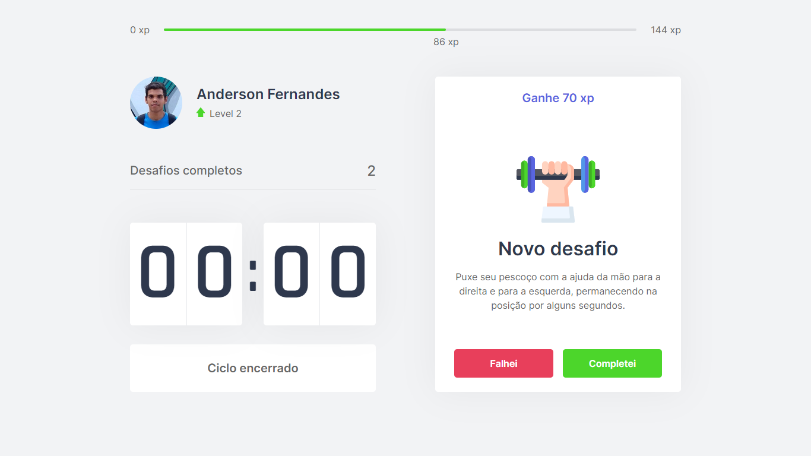

<h1 align="center">
  
</h1>

  <a href="#-tecnologias">Tecnologias</a>&nbsp;&nbsp;&nbsp;|&nbsp;&nbsp;&nbsp;
  <a href="#-projeto">Projeto</a>&nbsp;&nbsp;&nbsp;|&nbsp;&nbsp;&nbsp;
  <a href="#-layout">Layout</a>&nbsp;&nbsp;&nbsp;|&nbsp;&nbsp;&nbsp;
  <a href="#-como-executar-o-projeto">Como executar o projeto</a>&nbsp;&nbsp;&nbsp;|&nbsp;&nbsp;&nbsp;
  <a href="#-como-contribuir">Como contribuir</a>&nbsp;&nbsp;&nbsp;|&nbsp;&nbsp;&nbsp;
  <a href="#-licença">Licença</a>

  

 

  

 

  

## 🚀 Tecnologias

Este projeto foi desenvolvido utilizando as seguintes tecnologias:
- [TypeScript](https://www.typescriptlang.org)
- [React](https://pt-br.reactjs.org)
- [Next.js](https://nextjs.org)

## 💻 Projeto

O move.it é um app que une a técnica de Pomodoro com a realização de exercícios físicos para quem passa muito tempo na frente do computador.

## 🔖 Layout

Você poderá visualizar o layout da aplicação por [este link](https://www.figma.com/file/ge20pu3ofMOKoliUyKx1Nl/Move.it-1.0). É necessário ter uma conta no [Figma](http://figma.com/) para acessá-lo.

## 🚀 Como executar o projeto

- Clone o repositório
- Instale as dependências com `yarn`
- Inicie o servidor com `yarn dev`

Agora você pode acessar [`localhost:3000`](http://localhost:3000) do seu navegador.

## 🤔 Como contribuir

- Faça um fork desse repositório;
- Cria uma branch com a sua feature: `git checkout -b minha-feature`;
- Faça commit das suas alterações: `git commit -m 'feat: Minha nova feature'`;
- Faça push para a sua branch: `git push origin minha-feature`.

Depois que o merge da sua pull request for feito, você pode deletar a sua branch.

## 📄 Licença

Esse projeto está sob a licença [MIT](./LICENSE).

Feito com ❤️ por Diego Emanuel 👋🏽 [Entre em contato!](https://www.linkedin.com/in/anderson-fernandes-8b5a50135/)

---

##  Versões do README

[Português 🇧🇷](./README.md)  |  [Inglês 🇺🇸](./README-en.md)
